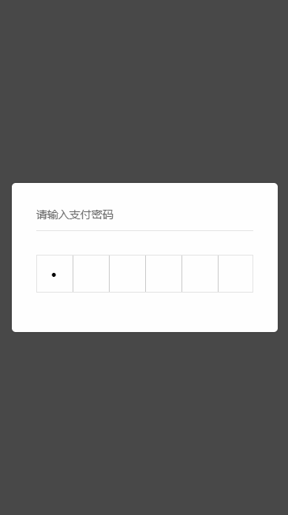
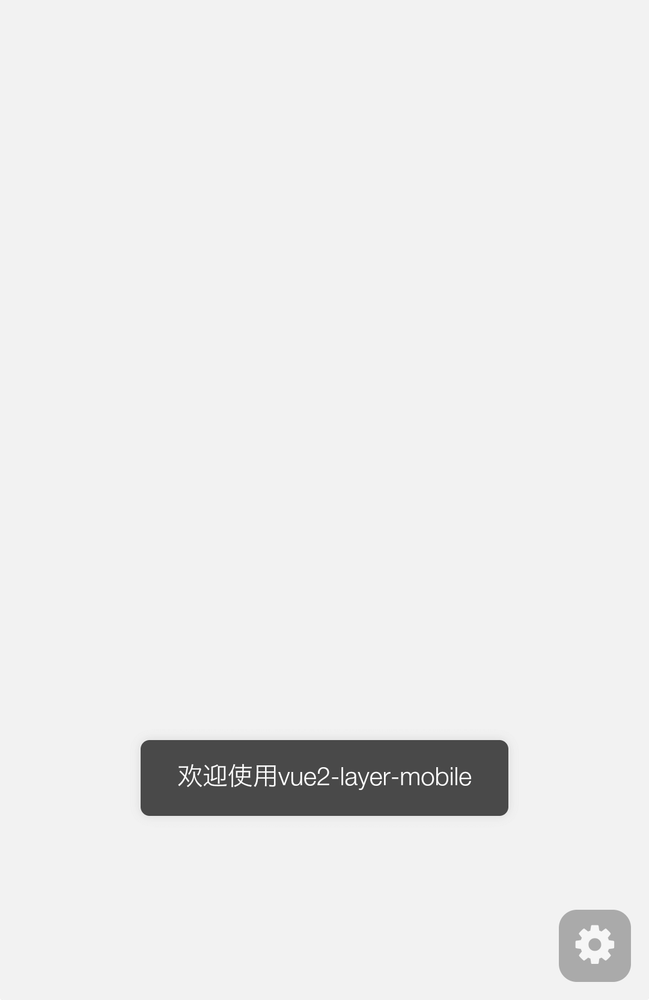
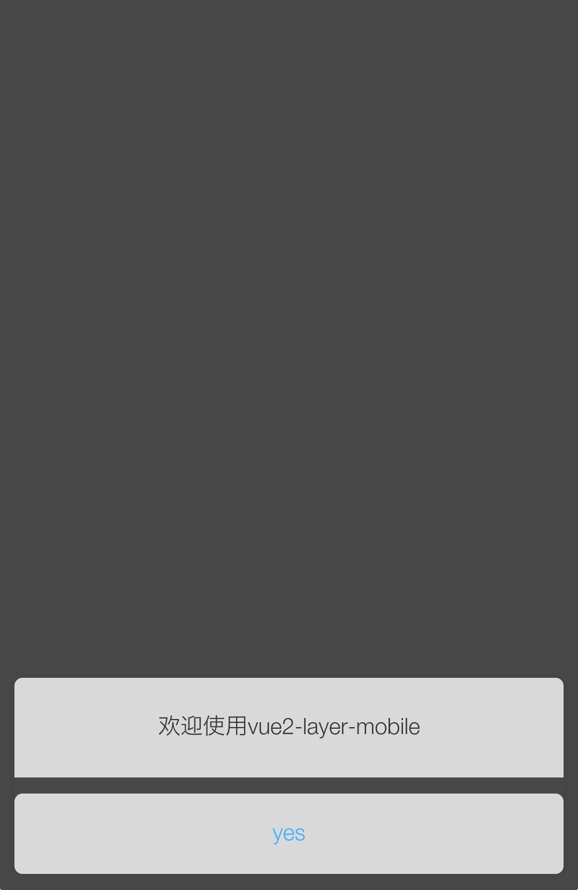
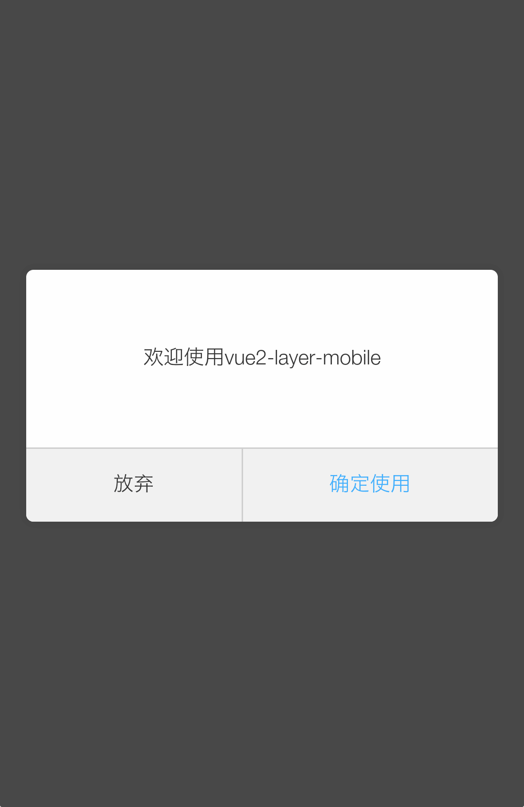

# vue2.0-layer-mobile移动端弹层

> 本次组件升级支持slot内容分发功能，实现高定制内容风格的弹层

## 安装方法

```javascript
npm install vue2-layer-mobile -S
```

## 初始化

```javascript
import layer from 'vue2-layer-mobile'
Vue.use(layer)
```

> 该组件是基于开源插件[layer-mobile](http://layer.layui.com/mobile/)用vue重新改写的，并且扩展了一些便捷方法
> 具体的API与layer-mobile高度保持一值，大家可以放心使用

## 组件使用

```javascript
// 普通使用
<layer @sure="yesFn" :btn="['确定使用', '放弃']" :content="'欢迎使用vue2-layer-mobile'"></layer>

// 利用 slot，自定义风格各异的弹层
// 扩展支持 slot 是为了解决以 plugin 形式时，通过 content 属性传入生成的内容不支持 vue 特性的问题
<layer @sure="yesFn" :btn="['确定使用', '放弃']" :content="'欢迎使用vue2-layer-mobile'">
   <div class="input-pwd-layer">
        <h2 class="f16 gray">请输入支付密码</h2>
        <div class="int-pwd-outer">
            <input @input="changeFn($event)" type="password" class="int-pwd" maxlength="6">
        </div>
    </div>
</layer>

```

## plugin形式调用

```javascript

// 询问层
const index = this.$layer.open({
    btn: ['确认', '取消'],
	content: 'hello word',
	className: 'good luck1',
	shade:true,
	success(layer) {
		console.log('layer id is:',layer.id)
	},
	yes(index, $layer) {
		console.log(arguments)
		// 函数返回 false 可以阻止弹层自动关闭，需要手动关闭
		// return false;
	},
	end() {
		console.log('end')
	}
})

// 关闭层
this.$layer.close(index)

// loading层
const index = this.$layer.open({
	type:2,
	content: '加载中...',
	success(layer) {
		console.log('layer id is:',layer.id)
	},
	end() {
		console.log('end')
	}
})

// 底部对话框
this.$layer.open({
	content: '这是一个底部弹出的询问提示',
	btn: ['删除', '取消'],
	skin: 'footer',
	yes: (index) => {
		this.$layer.open({content: '执行删除操作'})
	}
})

// 页面层
this.$layer.open({
	type: 1,
	content: '可传入任何内容，支持html。一般用于手机页面中',
	anim: 'up',
	// 特别注意，这个styles属性跟 layer-mobile 有点区别多加了个s，因为style在vue中是保留关键词
	styles: 'position:fixed; bottom:0; left:0; width: 100%; height: 200px; padding:10px 0; border:none;'
})

```

### 扩展方法

__以下方法都可以通过 this.$layer.open 这个方法来实现.__

提示层(msg)
```javascript

this.$layer.msg('hello world', () => console.log('end!!!'))

```

信息层(alert)
```javascript

this.$layer.alert('您确定要刷新页面吗', () => window.location.reload())

```

询问层(confirm)
```javascript
const index = this.$layer.confirm('您确定要删除吗？', () => alert('yes'), () => alert('no'))

setTimeout(() => {
	this.$layer.close(index)
}, 3000)

```

## API

### Props

| 参数 | 说明 | 类型 | 可选值 | 默认值 |
| ---- | ---- | ---- | ------ | ------ |
| type | 弹层的类型 | Number | 0表示信息框，1表示页面层，2表示加载层 | 0 |
| content | 弹层内容 | String | 必选参数 | 无 |
| title | 弹层标题 | String或Array | 值可以为字符串或者数组 |  |
| time | 控制自动关闭层所需秒数 | Number | 整数和浮点数 | 默认不开启 |
| styles | 自定义层的样式 | String | 如'border:none; color:#fff;' | |
| skin | 弹层显示风格 | String |  footer（即底部对话框风格）、msg（普通提示）| |
| className | 自定义一个css类 | String | custom-class | |
| btn | 按钮 | String/Array | 字符串或者数组(目前最多支持两个) | |
| anim | 动画类型 | String/Boolean | scale（默认）、up（从下往上弹出），如果不开启动画，设置false即可 | scale（默认） |
| shade | 控制遮罩展现 | Boolean | true/false | true |
| shadeClose | 是否点击遮罩时关闭层 | Boolean | true/false | true |
| fixed | 是否固定层的位置 | Boolean | true/false | true |
| top | 控制层的纵坐标 | Number | 整数和浮点数（一般情况下不需要设置，因为层会始终垂直水平居中，只有当fixed: false时top才有效） | 无 |
| success | 层成功弹出层的回调（只要以插件形式使用才有效），该回调参数返回一个参数为当前层元素对象 | Function | Function/null | null |
| yes | 点确定按钮触发的回调函数，返回一个参数为当前层的索引（只要以插件形式使用才有效） | Function | Function/null | null |
| no | 点取消按钮触发的回调函数（只要以插件形式使用才有效） | Function | Function/null | null |
| end | 层彻底销毁后的回调函数（只要以插件形式使用才有效） | Function | Function/null | null |

### Slots

| name | 描述 |
| ---- | ---- |
| default | 弹出框的内容 |

### Events

| name | 说明 | 回调参数 |
| ---- | ---- | -------- |
| sure | 点击确认按钮时触发 | 无 |
| cancel | 点击取消按钮时触发 | 无 |
| show | 弹窗可见时触发 | 无 |
| close | 弹窗关闭时触发 | 无 |

*`这些事件不适用于以插件形式调用的事件监听处理（它有自己的处理事件方法见以上api如yes、no等）`*


### 插件形式的内置方法/属性

返回当前使用的layer mobile版本号
```javascript
this.$layer.v
```

用于关闭特定层，index为该特定层的索引
```javascript
layer.close(index)
```

关闭页面所有layer的层
```javascript
layer.closeAll()
```


## 说明

1.参数(options)

~~style~~改成`styles`
~~shade~~不支持自定义透明度与背景色

*特别注意，这个styles属性跟 layer-mobile 有点区别多加了个s，因为style在vue中是保留关键词*

2.扩展方法\[msg、alert、confirm\]
*只有当你调用以上扩展方法时*，会自动给层添加一个css类'layui-m-'\+方法名\[msg、alert、confirm\]

## 效果图

利用 slot 自定义弹层
    

信息弹层
    

提示
    

底部提示弹层
    

询问弹层
    


